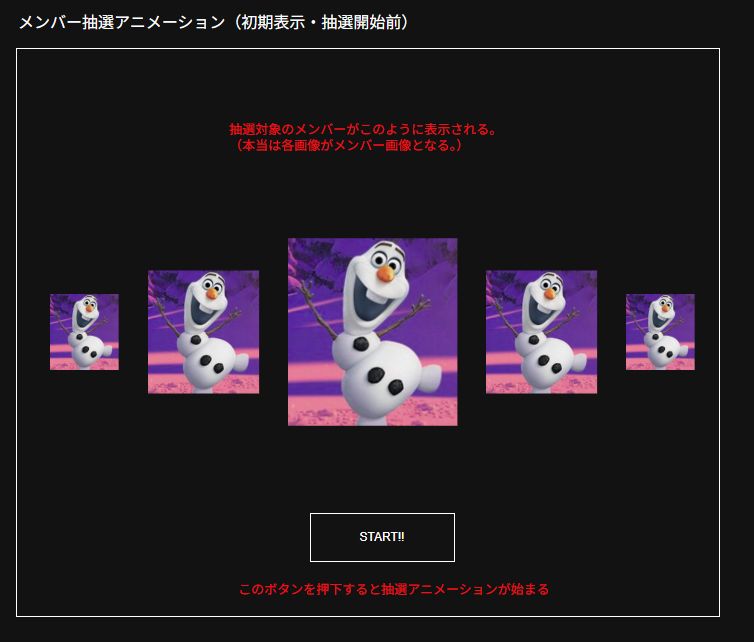
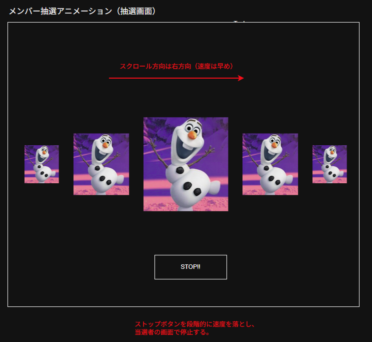
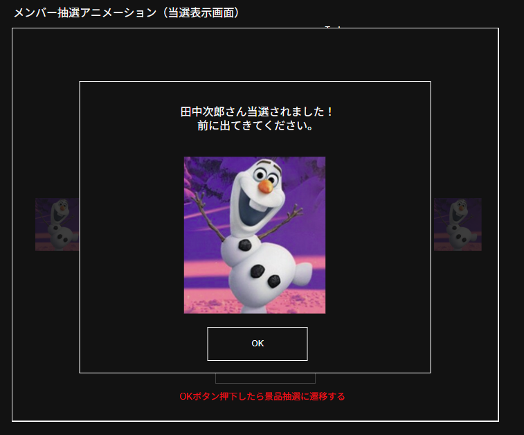
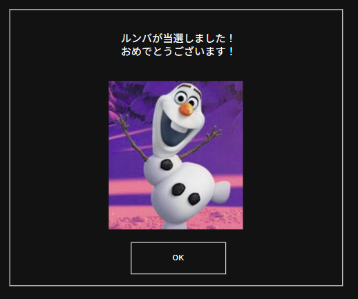
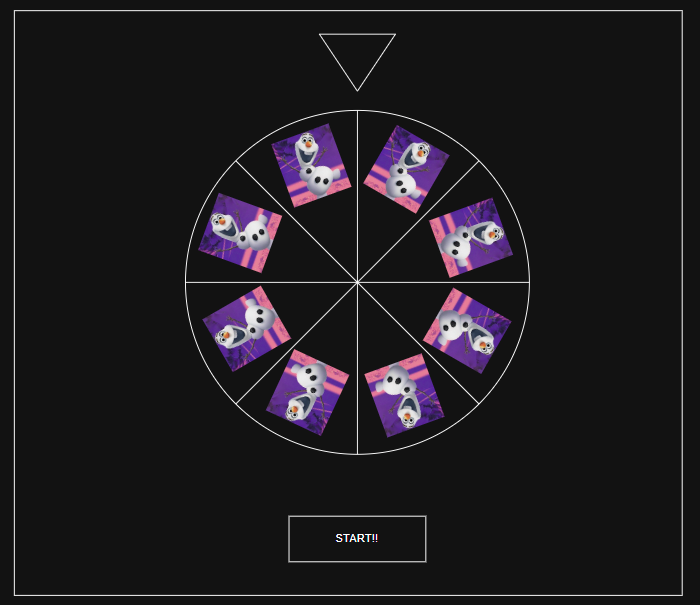
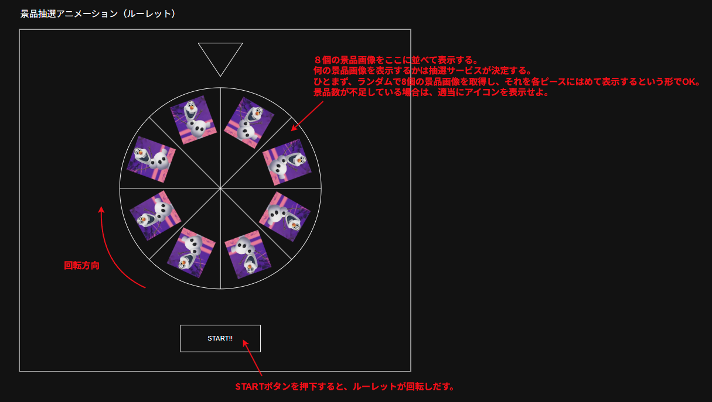
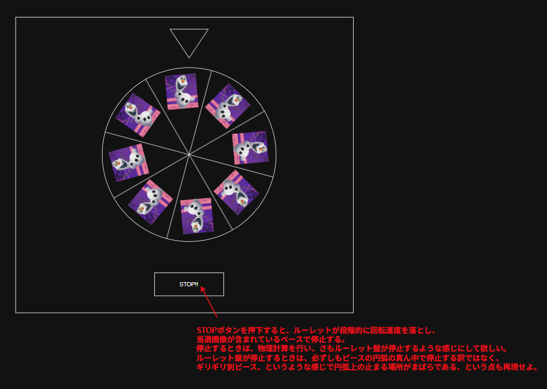
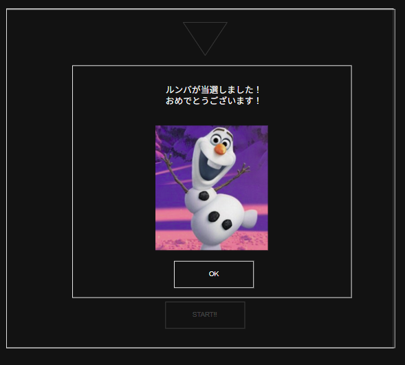

■抽選に関する画面について
抽選における画面は

1. デモ抽選画面
2. 本抽選画面
   の2種類がある。
   本抽選画面が実際にジャックポットゲームのコア画面であり、デモ抽選画面はゲームの説明用に表示するための画面である。
   詳細は後述する。

■本抽選のフロー
本抽選画面は

1. メンバー抽選
2. 景品抽選
   という流れで進む。
   具体的には、
3. 初期表示（メンバー抽選画面を表示する）
4. Enterキー押下でメンバー抽選（抽選アニメーション）が開始する
5. Enterキー押下で抽選アニメーションが停止し、当選者をモーダルDLGで表示する
6. Enterキー押下でメンバー抽選画面から景品抽選画面に切り替える（同じvueファイル内で定義される想定）
7. Enterキー押下で景品抽選が実行される。尚、その際、各景品単位で抽選アニメーション（抽選アニメーションID）を持っているので、それを元に抽選アニメーションを表示する。
   尚、各景品単位で抽選時のBGMを持っているので、抽選アニメーションが開始すると同時にBGMを再生する。
8. Enterキー押下で抽選アニメーションが停止し、1秒間停止状態を継続させ、当選した景品をモーダルDLG（当選表示DLG）で表示する。
9. Enterキー押下で1.の初期表示を行う
   以降はこれをループし、当選していない景品が存在しなくなったら抽選は終了。

という感じである。

■メンバー抽選について（モデル層）
メンバー抽選はDrawServiceの"\_drawMember"関数で実行する。
抽選アルゴリズムは一番シンプルなもので良い。
一度に当選するのは1名とし、当選者が確定したらそのメンバーのIDをdrawMember関数が返却する。
各メンバーにはランクが設定されているので、ランクが高いものほど当選しやすいようにせよ。
その際、ローカルストレージに抽選結果を保存する。（抽選結果の構造については後述）

しかし、それだけだと抽選時に1名しか候補が出なくなるので、別途DrawServiceに"getDummyMember"関数を用意する。この関数は引数に
・除外するメンバーID
・ダミーとして要求するメンバーIDの数
を渡し、メンバー設定で登録されているメンバー群から除外対象として指定されたメンバーを除いたメンバーを指定した数のメンバーIDを返却する。
このダミーメンバーには既に当選済みのメンバーが含まれていてもOK。

UI層はこの2つの関数を呼び出さないといけない、という手続きは知りたくないので、UI層からは
drawMember(/_ 要求するメンバー数 _/): { 当選メンバーID: string; ダミーメンバーID: string }
という関数を呼び出せばOKとするようにせよ。
尚、全てのメンバーが当選している状態になった場合、当選メンバーIDを空にせよ。

最初に提示した\_drawMember関数とgetDummyMember関数はprivate関数とし、外部公開しないようにせよ。

■メンバー抽選について（UI層）
基本的には

1. 10人分のメンバーを先述のdrawMember関数で取得する。
2. 10人分のメンバーIDを元にMemberServiceからメンバーデータを取得する。
3. 取得したメンバーデータからメンバー画像をAssetServiceから取得する。
4. 取得したメンバー画像群を以下のような感じで表示する。これで抽選準備OK。
   
5. Enterキー押下すると、下図で示しているように右方向にメンバー画像がスクロールされていき、抽選演出を開始する。同時に、設定されたメンバー抽選BGMの中からランダムで一つを選択して再生を開始する。
   
6. Enterキー押下すると、段階的に右スクロール速度を低下させ、最後完全停止させる。完全停止と同時にBGMを停止する。完全停止1秒後に下図のような当選DLGを表示する。
   
7. Enterキー押下すると当選DLGが閉じ、景品抽選画面が表示される。

という感じで実行される。
景品抽選が終了し、景品抽選の当選DLGが閉じられたら再度1.からフローが始まる。

■景品抽選について（モデル層）
景品抽選は基本的にはメンバー抽選と同じ。
但し、ランクの高いメンバーにはランクが高い景品が当選しやすくなるようにせよ。
UI層からは
drawPrize({ メンバーID: string; 要求する景品数: number}): { 当選景品ID: string; ダミー景品ID: string }
という関数を呼び出せばOKとするようにせよ。
\_drawMember関数とgetDummyMember関数はそれぞれ\_drawPrize関数とgetDummyPrize関数となる。
\_drawPrize関数だが、メンバーのランクを考慮した景品抽選をしないといけないことに注意せよ。

あと、あとの当選していない景品が何個あるかを返却する関数"getLastPrizeCount"関数を公開せよ。
（getLastPrizeCount(): { 総数: number; 残数: number }）

景品抽選だが、一番最初に一番ランクが高いもの or 一番ランクの低いものが当選すると面白くないので、
最初の3回は通常の景品が当たるようにせよ。
通常の景品とは、全景品のランクの中で最頻値のランクが設定されている景品を指す。

景品の残数が半分になる前を"前半"、それ以降を"後半"とする。
前半と後半に1回ずつ"確変"を発生させる。
前半は最初の3回以降の抽選で確変を発生させるものとする。
基本的には
前半の確変発生タイミング：4回目～景品残数が半分になるまでの真ん中ぐらい
後半の確変発生タイミング：真ん中ぐらい
のタイミングで実行する。
例えば、景品総数が10とする場合、
前半：1回目～5回目
後半：6回目～10回目
と分割される。
そして、前半は3回までは通常当選とするため、
前半の確変発生タイミング：4～5回目
後半の確変発生タイミング：7～8回目
に発生する。
確変が開始したら確変BGMを再生する。（抽選画面設定で設定できるようにする）
確変の継続回数は2回とする。
確変時は再抽選を実行させる。
再抽選とは、一度抽選を行いEnterキー押下で抽選が確定するが、2秒後に再度自動的に抽選アニメーションが実行され、本来の当選した景品で抽選アニメーションを停止させる演出のことである。
再抽選時は1回目の抽選は景品設定のBGM1、2回目の抽選時はBGM2の音楽を再生するようにせよ。
2回目の抽選は2秒間抽選アニメーションを表示した後、段階的に速度を停止し、本来の当選した景品でストップさせる。
1回目の抽選はdummyの中から1つ選択する形で良い。

確変時用に一番ランクの高い景品と一番ランクが低い景品を2つずつ確保しておきたいので、最初の景品抽選で確変用にプログラム上で予約しておく。
予約というのは、景品自体は当選扱いとするが、当選者IDが設定されていないものである。
メンバー数、景品の数やランクの振り分け次第では、確変タイミングや景品予約が上手くできない場合があるかもしれないので、そこは抽選フローが止まらないように安全側に倒した実装としてもらいたい。
（確変タイミングが決められなかったり、予約する景品が決められなかったりで無限ループやデッドロックのような感じになることを避けたい）

■景品抽選について（UI層）
基本的には、

1. 8個分の景品を先述のdrawPrize関数で取得する。
2. 8個分の景品IDを元にPrizeServiceから景品データを取得する。
3. 取得した景品データから景品画像をAssetServiceから取得する。
4. 各景品データには抽選アニメーションIDが設定されている。取得した景品画像、当選景品ID、Dummy景品IDを元に、抽選アニメーションIDに紐づく抽選アニメーションを表示する。
5. 各抽選アニメーション内でEnterキー押下すると抽選が停止するので、完全停止1秒後にメンバー抽選と同じく、当選DLGをモーダル表示する。当選DLGは下図のようなデザインを想定。
   
6. 当選DLGでEnterキー押下すると、メンバー抽選に戻る。

という流れである。6.でEnterキーを押下された時に、getLastPrizeCount関数を呼び出し、残数が半分となったら、「残り半分です！」というモーダルメッセージを表示したい。
残数が0となった場合は、「これで終了です！」というモーダルメッセージを表示したい。

＜ここからは景品の抽選アニメーションに関する仕様＞
■ルーレット
基本的なデザインは以下のような感じ。

STARTボタンを押下すると、右回りにルーレットが回転する。
STOPボタンを押下すると、段階的にルーレットの回転速度が低下し、当選した景品IDのところで停止する。
完全停止して1秒後に下図のような当選DLGをモーダル表示する。

再抽選が発生した場合は、STARTとSTOPボタンを非表示にし、自動的に抽選を開始→停止を行う。抽選時間は2秒。

■その他
他の抽選アニメーションは現在検討中。
