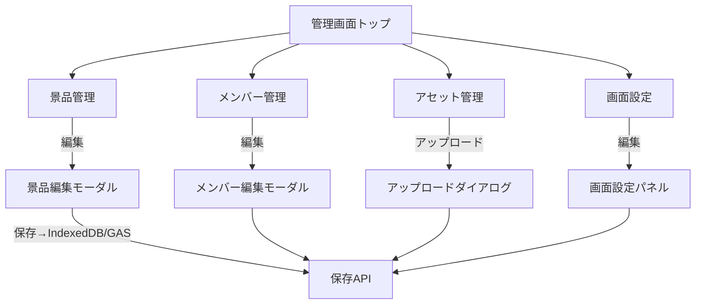
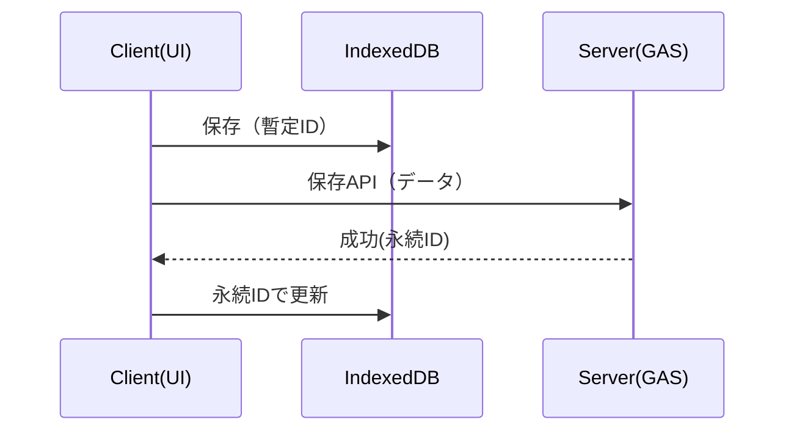

# 基本設計書 — 管理画面（Admin）

作成目的

- 現状のラフな画面仕様（`画面仕様書.md`）および要件（`要求・仕様・要望.md`）を踏まえ、管理画面に関してクリーンで実装可能な基本設計を提示する。
- 管理画面は実行画面（プレゼンテーション側）の設定・アセット・データを編集・保存するためのUIであり、以降の詳細設計・実装の基礎とする。

対象範囲

- 本書は管理画面（管理者用UI）のみを扱う。実行画面の仕様は別途作成する。

前提

- 実行環境はGoogle Apps Script (GAS) をセカンドストレージ（secondary storage）として利用する。つまり、アプリ起動時に `index.html` を取得した後は原則ローカル（IndexedDB / localStorage）で完結する。GAS との通信はローカルのデータを Google Drive または Spreadsheet と同期する時のみ行う。
- クライアントはVue.js（現行実装に準拠）で、IndexedDBをローカルの一次ソース（local-first）として使う。
- 既存実装は `/src/client/octopus-scheduler`（フロント） と `/src/server/octopus-scheduler-api`（GAS）にある。

成果物（本基本設計で描くもの）

- 管理画面の画面一覧と責務
- 各画面の主要UI要素
- 主要データ構造（テーブル形式で列挙）
- 管理画面側API契約（リクエスト／レスポンス）
- 保存・同期の振る舞い（IndexedDBとGASの関係）
- 主要ユースケースフロー（mermaid）

## 1. 管理画面 概要と画面一覧

管理画面は以下の機能を持つダッシュボード形式のWebアプリケーションである。

- ダッシュボード（一覧・状態）
- 景品管理（Prizes）: 登録/編集/削除、表示順、ランク、画像・BGM・SEの紐付け
- メンバー管理（Members）: 登録/編集/削除、写真、属性、並び順
- アセット管理（Assets）: 画像/音声/動画/HTML/テキストのアップロード、検索、参照、削除
- 画面設定（Screens）: 各実行画面（home/opening/description/demo/main/result）の演出設定・表示順・BGM/SE割り当て
- 抽選演出設定（LotterySettings）: ルーレット/スロット等の演出種別とパラメータ
- プレビュー（簡易）: 編集した設定を管理画面内で簡易プレビュー（HTML断片の挿入・テキスト確認）
- バックアップ・復元: 設定のエクスポート/インポート（JSON）

各画面はSPA内のサブページとして開く想定。編集はモーダルまたはサイドパネルで行う。

## 2. 主要ユースケース（高レベルフロー）

（注）mermaid図は本仕様内で可視化用途に使用する。

## 3. データ構造（テーブル）

以下は管理画面で扱う主要データの最小必須フィールドを示す。GAS（スプレッドシート/Drive）側の永続化に合わせ、IDはサーバー発行（assetはサーバー発行も可）、ローカルでは一時IDを許容する。

- 共通ルール
  - id: string (UUID または server-id)
  - createdAt, updatedAt: ISO 8601 時刻文字列
  - order: number (表示順)

Prizes (景品)
| フィールド | 型 | 必須 | 備考 |
|---|---:|:---:|---|
| id | string | Yes | `p_{timestamp}_{rand}` など |
| name | string | Yes | 表示名 |
| rank | number | Yes | 1=最高（数値が小さいほど高ランク） |
| description | string | No | HTML またはプレーンテキスト |
| imageAssetId | string | No | アセットID |
| bgmAssetId | string | No | アセットID |
| seAssetIds | string[] | No | 複数SE |
| order | number | Yes | 表示順 |
| quantity | number | Yes | 在庫数（設計で固定: 1） |
| meta | object | No | 拡張情報 |

Members (メンバー)
| フィールド | 型 | 必須 | 備考 |
|---|---:|:---:|---|
| id | string | Yes | `m_{timestamp}_{rand}` |
| name | string | Yes | 表示名 |
| photoAssetId | string | No | アセットID |
| attributes | string[] | No | タグや属性 |
| order | number | Yes | 表示順 |
| meta | object | No | 拡張情報 |

Assets (アセット)
| フィールド | 型 | 必須 | 備考 |
|---|---:|:---:|---|
| id | string | Yes | サーバー発行の永続ID。クライアントアップロードでは一時IDを使う |
| type | enum | Yes | image|audio|video|text|html |
| name | string | Yes | ファイル名/表示名 |
| url | string | Yes | Driveの公開/署名済URL（参照用） |
| size | number | No | bytes |
| uploadedAt | string | Yes | ISO日時 |
| meta | object | No | MIME等 |

ScreenConfig (画面設定)
| フィールド | 型 | 必須 | 備考 |
|---|---:|:---:|---|
| id | string | Yes | `screen_{type}` など |
| type | enum | Yes | home|opening|description|demo|main|result |
| bgmAssetId | string | No | 背景BGM |
| elements | object[] | Yes | 表示要素の配列（後述） |
| animationSettings | object | No | 画面全体のアニメ設定 |

ScreenElement

- id: string
- type: text|image|video|button|list|progress|custom
- content: string (text/html) |
- assetId?: string
- order: number
- settings?: object

LotterySettings
| フィールド | 型 | 必須 | 備考 |
|---|---:|:---:|---|
| id | string | Yes | `lottery_settings` |
| method | enum | Yes | roulette|slot|random |
| params | object | No | 演出パラメータ（duration, velocity, easing 等） |

Results（出力）
| フィールド | 型 | 必須 | 備考 |
|---|---:|:---:|---|
| id | string | Yes |
| memberId | string | Yes |
| prizeId | string | Yes |
| order | number | Yes | 抽選順 |
| createdAt | string | Yes |

## 4. API 契約（管理画面→GAS）

契約は最小限で記載する。実装時はTypeScriptの型定義ファイルを共有する。

GET /api/prizes

- request: none
- response: { prizes: Prize[] }

POST /api/prizes

- request: { prize: Prize } (idがなければ作成)
- response: { prize: Prize }

DELETE /api/prizes?id={id}

- response: { success: boolean }

GET /api/members

- response: { members: Member[] }

POST /api/members

- request: { member: Member }
- response: { member: Member }

POST /api/asset

- request: multipart/form-data または base64 埋め込み JSON
- response: { assetId: string, url: string }

GET /api/screen-config?type={type}

- response: { screen: ScreenConfig }

POST /api/screen-config

- request: { screen: ScreenConfig }
- response: { screen: ScreenConfig }

POST /api/export-config

- request: none
- response: { configJson: string }

POST /api/import-config

- request: { configJson: string }
- response: { success: boolean }

認証: 管理画面APIの厳格な権限分離は不要（要件により複数ロールは導入しない）。ただし、GAS 側での API 呼び出しは信頼できるクライアントからのみ許可する（Basic check）。必要に応じて OAuth を簡易に導入する運用は選択可能。

## 5. 同期モデル — IndexedDB と GAS の関係

- クライアントはIndexedDBを一次ソースとしてUI表示を行う。
- 編集/追加時はまずIndexedDBに保存(optimistic update)。
- バックグラウンドでGAS APIへ同期を行い、成功時にサーバー発行のIDやurl等でローカルデータを更新する。
- 同期失敗時はリトライとUI通知（トースト）を行う。編集時の競合は最終書き込み勝ち（last-write-wins）を基本とするが、必要であればバージョン/etag方式に変更する。

同期フロー（簡易）

## 6. UI レイアウトと操作性（管理画面の設計指針）

- 編集操作はモーダル/スライドパネルで行う。
- 単一画面で多機能になりすぎないよう、タブ・セクションに分割する。
- アセット選択はダイアログで行い、一時アップロード→リストから選択で最終確定する。複数選択と単数選択の両方をサポート。
- 入力のバリデーションはクライアントで即時（必須チェック、型チェック、文字数制限）、サーバーでも再検証する。

## 7. バリデーション方針（管理画面）

- クライアント側: 必須項目、文字数、数値範囲、ファイルサイズ・MIMEタイプ制限
- サーバー側: 同様の検証に加え、スプレッドシートやDriveの権限・エラーをハンドリング
- エラーフィードバック: トースト＋フィールドハイライト＋詳細ログ

## 8. バックアップ、エクスポート/インポート

- 全設定（prizes, members, assets meta, screens, lotterySettings）を1つのJSONにエクスポート可能。
- インポートはJSON検証を行い、差分インポート（id一致で上書き、idなしで新規作成）を行う。

## 9. 運用上の注意点と推奨事項

- アセットはDrive上で一元管理し、容量と命名規約を運用ルールとして決める。
- 定期的に古いアセットをクリーンアップするジョブを計画する。
- 管理画面操作は必ず監査ログ（ユーザー・タイムスタンプ・操作種別）を取ること。

## 10. QA（未決・確認事項）

- 【QA】アセットの公開URLはGoogle Driveの公開リンクを使う想定か、署名付きURL（短期有効）を使う想定か？
- 【QA】景品のquantity（在庫）取り扱いは実行時に即座にデクリメントする方式でよいか（排他制御はSpreadsheetレベルで必要）？
- 【QA】管理者ユーザーの権限分離（複数ロール：viewer/editor/admin）は必要か？

---

作成者注: 本基本設計は管理画面に必要な構成要素を網羅的に整理したものです。次はこれを元に画面別の詳細設計（フィールド単位の仕様、JSONサンプル、API例、UIワイヤーの具体化）を作成します。
