管理画面の基本レイアウト

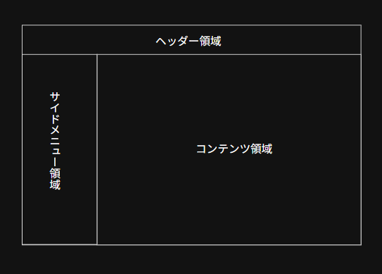

 
サイドメニューの構成

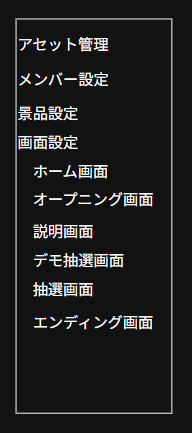

 
共通部品

アセット選択ダイアログ

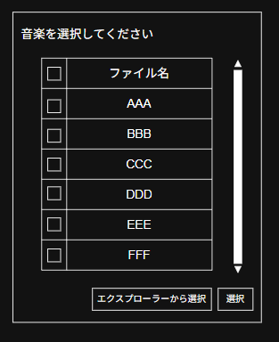

エクスプローラーから選択：押下するとエクスプローラーからアセットを選択できる。エクスプローラーで選択してOKを押下すると、それが反映される。（一時的にDLGを開いた画面でアップロードデータが保持されるが、ローカルストレージに保存されるのはDLGを開いた画面で保存処理を実行した時）

エクスプローラーからの追加の場合、多分一時的なIDを発効し、保存時にアセット保存処理後に正式なIDに置換する形になると思う。

単数選択の場合は

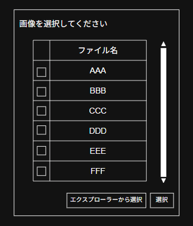

こんな感じで表示される。もう少し直観的なUIだと良いかも。

 
各画面構成

アセット管理画面

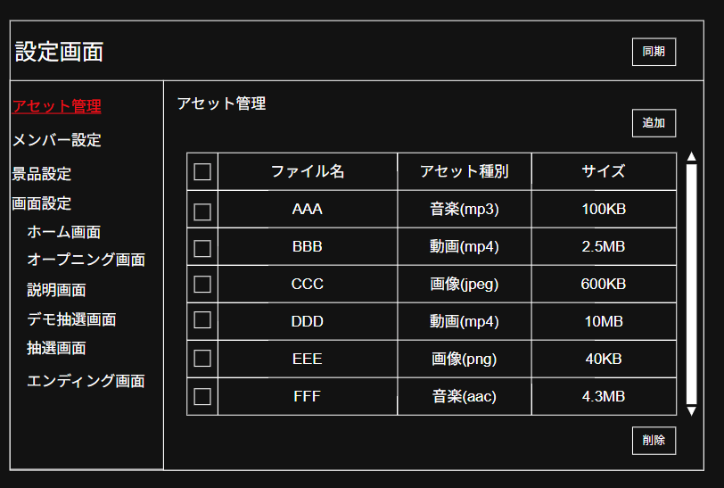

メンバー設定画面

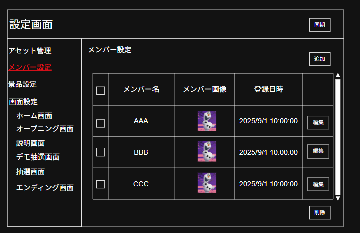

追加ボタン押下したら

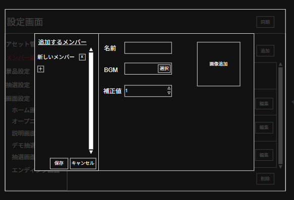

が表示される。

右側で入力された値はリアルタイムで左側に反映される。こんな感じ。

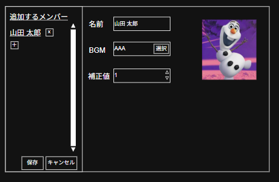

複数追加するとこんな感じ。

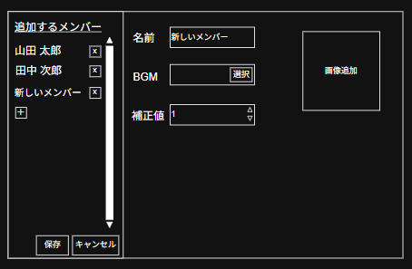

保存押下したら一気に保存される。

編集ボタン押下したらこんな感じ。

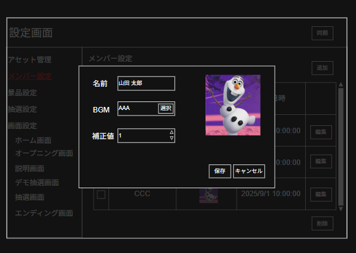

BGMで選択ボタンを押下するとアセット選択ダイアログが表示される。

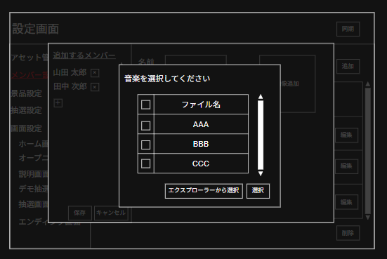

 
景品設定画面

ほぼメンバー設定画面と同じUI構成

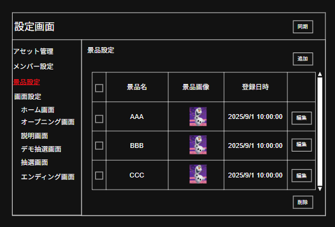

追加ボタン押下したら以下が表示される。

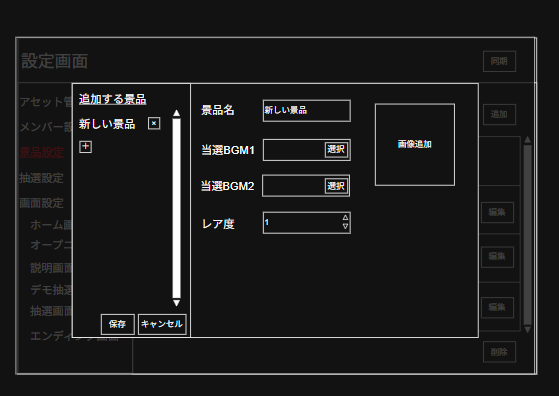

入力するとこんな感じ。

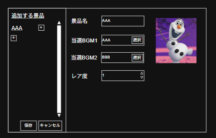

編集ボタン押下したらこんな感じ。

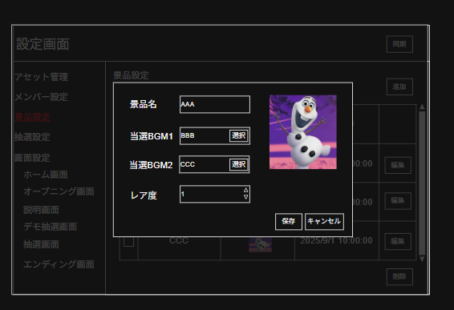

 
ホーム画面設定画面

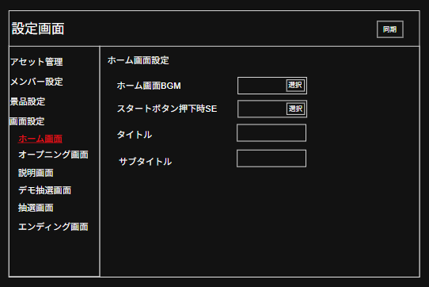

 
オープニング画面設定画面

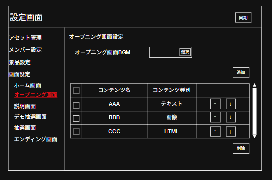

追加ボタンを押下すると

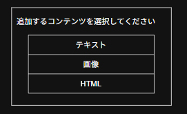

がモーダルで表示され、項目をダブルクリックするとそれぞれ以下が表示される。

テキストを選択した場合

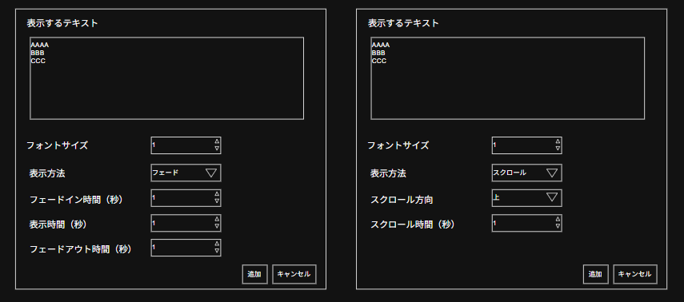

画像を選択した場合

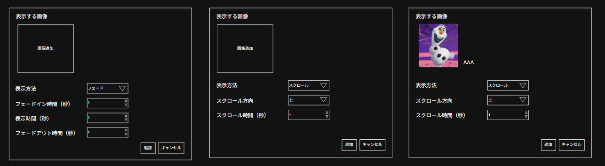

HTMLを選択した場合

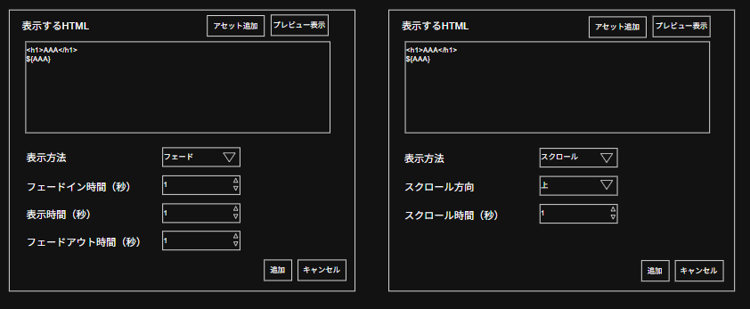

プレビュー表示ボタンは入力されたHTMLが実際にどのように表示されるのかその場で確認するためのもの。

アセット追加は、カーソル位置に置換文字列が挿入される形になる。画像に例を示しているが、もっと最適な方法があるかもしれない。

 
説明画面設定

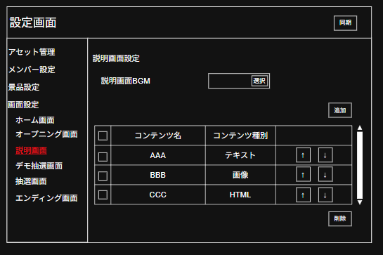

ほぼオープニング画面設定画面と同じUI構成

 
デモ抽選画面設定

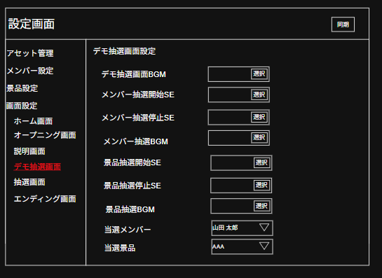

 
抽選設定画面

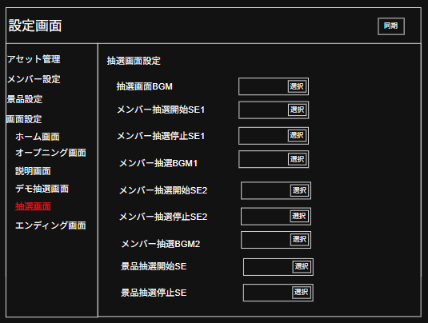

 

エンディング設定画面

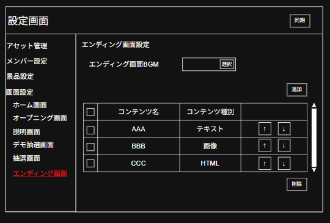

ほぼオープニング画面設定画面と同じUI構成
