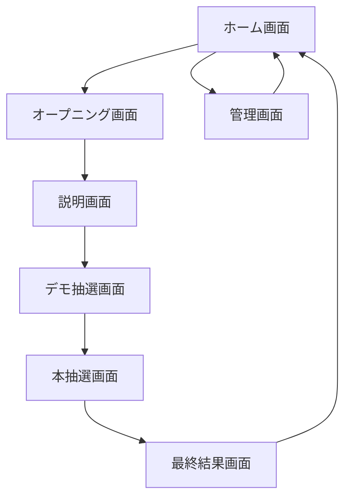

# 本仕様書策定者ペルソナ

本仕様書は、WEBアプリ・Google Apps Script・Vite・TypeScript・DIコンテナ・2D/3Dグラフィック・UI/UX・WEBデザインに深く精通し、数多くの大規模プロジェクト経験を持つシニアエンジニア/デザイナーが策定する。

---

## 画面遷移・状態管理設計

### 画面遷移図（フローチャート例）


### 画面間パラメータ受け渡し
- 画面遷移時、抽選結果・選択メンバー・景品ID等をVue Router/React Routerのstate/propsで受け渡し
- 画面遷移アニメーションはGSAP/CSSで設計

---

### DIコンテナ設計
- サービス/リポジトリ/ユースケース/ファクトリの依存関係を明示
- DIコンテナ初期化例（TypeScript）
```typescript
import { createContainer } from 'typedi';
const container = createContainer();
container.set('PrizeRepository', new PrizeRepositoryImpl());
container.set('LotteryService', new LotteryService(container.get('PrizeRepository')));
```
- スコープ設計：Singleton（アプリ全体）、Transient（画面単位）、Request（API単位）

---

### API仕様詳細
- 各APIのリクエスト/レスポンス型定義（TypeScriptインターフェース）
- バリデーション仕様（必須項目、型、値域、エラーコード）
- 管理画面APIは認証（JWT/Google OAuth）必須
```typescript
interface GetPrizesRequest {}
interface GetPrizesResponse { prizes: Prize[]; }
interface ErrorResponse { code: string; message: string; }
```

---

### IndexedDBスキーマ
- テーブル/オブジェクトストア一覧：prizes, members, assets, results, screenConfigs
- バージョン管理・マイグレーション方針：新規追加時はバージョンアップ、旧データは自動マイグレーション
- IndexedDBラッパーAPI例
```typescript
class IndexedDBRepository {
  save<T>(store: string, value: T): Promise<void> {}
  load<T>(store: string, key: string): Promise<T> {}
}
```

---

### アセット管理詳細
- Google Driveフォルダ構成例：/jackpot-assets/{type}/
- アセットID命名規則：asset_{type}_{timestamp}_{random}
- アップロード/削除/参照フロー図（テキスト）
  1. クライアントでIndexedDB保存
  2. GAS API経由でGoogle Driveアップロード
  3. アセットIDを受け取りIndexedDBに紐付け
  4. 参照はIndexedDB優先、Driveはバックアップ

---

### 演出・アニメーション仕様
- 各演出のパラメータ（速度、タイミング、SE/BGM割り当て、イージング）
- PixiJS/Three.js/GSAPの利用範囲・サンプルコード
```typescript
import { gsap } from 'gsap';
gsap.to('#title', { scale: 1.2, duration: 0.5, ease: 'power2.inOut' });
```
- アニメーション設計：CSS/JS/Canvas/WebGLの使い分け

---

### 管理画面UI/UX設計
- 入力フォーム項目一覧・バリデーション仕様
- 編集/保存/削除操作フロー
- アセットプレビュー・試聴機能
- レスポンシブデザイン・アクセシビリティ対応（キーボード操作、色彩設計）

---

### エラー・例外処理方針
- 通信失敗時のリトライ回数（最大3回）、エラー表示方法（ダイアログ/トースト）
- GAS側のエラー返却仕様（HTTPステータス/エラーコード/メッセージ）

---

### テスト・デバッグ方針
- モックデータ/モックAPIの用意
- E2Eテスト/ユニットテストの範囲・ツール選定（Jest/Cypress/Playwright等）

---

### 多言語対応・アクセシビリティ
- 文言管理（i18n対応）、アクセシビリティ要件（キーボード操作、色彩設計、コントラスト比）

---

### ホーム画面（統合設計）

#### 1. 画面設計・UI構成
- タイトル（アニメーション表示、拡大・縮小演出）
- プログレスバー（アセットDL進捗、光・波打つアニメーション）
- 「スタート」ボタン（フェードイン、押下SE、ふわっと浮かび上がる）
- 「管理画面」ボタン（開発・運用用、後で削除可能）
- 背景（パステルカラー、近未来的グラデーション）
- BGM（DL完了後再生、音源アップロード・試聴可）

#### 2. 画面遷移・操作
- 「スタート」押下でオープニング画面へ遷移
- 「管理画面」押下で管理画面へ遷移

#### 3. 設定項目
- BGM（音源アップロード・試聴）
- ボタン押下SE（音源アップロード・試聴）
- プログレスバー完了SE（音源アップロード・試聴）

  - `fetchPrizes(): Promise<Prize[]>`
  - `fetchMembers(): Promise<Member[]>`
  - `runLottery(data): Promise<LotteryResult[]>`
  - `saveResult(result: LotteryResult): Promise<void>`
  - `uploadAsset(asset: Asset): Promise<string>`
- `IndexedDBRepository`：ローカルキャッシュ
  - `save(key: string, value: any)`
  - `load(key: string): any`

### サーバー側（GAS）主要クラス

#### App層
- `LotteryController`：APIエンドポイント
  - `doGet(e)`
  - `doPost(e)`
  - `runLottery(data)`
- `AssetController`：アセットAPI
  - `uploadAsset(asset)`
  - `getAsset(id)`

#### Domain層
- `Lottery`：抽選集約
  - `draw(prizes, members): LotteryResult[]`
- `Prize`：景品モデル
  - `isHighRank()`
- `Member`：メンバーモデル
  - `isEligible()`

#### Infrastructure層
- `SpreadsheetRepository`：データ永続化
  - `saveResult(result)`
  - `loadPrizes()`
  - `loadMembers()`
- `DriveRepository`：アセット管理
  - `upload(asset)`
  - `get(id)`

---
---

## 基本設計：ドメイン駆動設計・クリーンアーキテクチャ思想の導入

本アプリは、クライアント（Web）側とサーバー（GAS）側の2環境に分け、両者でApp・Domain・Infrastructure層を持つ設計とする。
GAS関数は両者のInterface（API）となり、クライアント側Infrastructure層がサーバー側App層の関数（GAS関数）を呼び出す。

### 1. 層構成と責務

#### クライアント側
- **App層**：画面遷移・UI制御・ユーザー操作・アプリケーションサービス（抽選開始、結果表示、設定保存等）
- **Domain層**：抽選ロジック、景品・メンバー・結果の集約、ドメインモデル（Prize, Member, Lottery, Asset等）
- **Infrastructure層**：GAS API呼び出し、IndexedDBキャッシュ、アセット管理、外部通信

#### サーバー側（GAS）
- **App層**：GAS関数（API）、リクエスト受付・レスポンス生成、アプリケーションサービス（抽選実行、データ保存等）
- **Domain層**：抽選ロジック、景品・メンバー・結果の集約、ドメインモデル
- **Infrastructure層**：Google Drive/Spreadsheet操作、外部API連携、データ永続化

### 2. 層間の関係
- クライアント側App層はDomain層のサービスを呼び出し、必要に応じてInfrastructure層経由でGAS APIを利用
- サーバー側App層はDomain層のサービスを呼び出し、Infrastructure層で永続化・外部連携
- クライアント側Infrastructure層はサーバー側App層（GAS関数）をAPIとして呼び出す

### 3. GAS関数の役割
- クライアント・サーバー間のインターフェース（API）
- データ取得・保存・抽選処理・アセット管理等を提供
- クライアント側Infrastructure層からのみ呼び出し

### 4. 図解（テキスト）

```
クライアント環境
┌─────────────┐
│ App層        │ ← UI/画面遷移・サービス
├─────────────┤
│ Domain層     │ ← 抽選ロジック・集約
├─────────────┤
│ Infrastructure│ ← GAS API/IndexedDB
└─────────────┘
         │
         ▼
サーバー環境
┌─────────────┐
│ App層        │ ← GAS関数/API
├─────────────┤
│ Domain層     │ ← 抽選ロジック・集約
├─────────────┤
│ Infrastructure│ ← Drive/Spreadsheet
└─────────────┘
```

### 5. 具体的な設計例

- クライアント側App層：抽選開始時、Domain層のLotteryServiceを呼び出し、結果をInfrastructure層経由でGAS APIに保存
- サーバー側App層：GAS関数runLotteryでDomain層のLotteryモデルを利用し、結果をInfrastructure層でSpreadsheetに保存

---
---

## Google Apps Script関数設計・API仕様

### 1. 基本方針
- クライアント（Webアプリ）からGAS Web APIを呼び出し、データ取得・保存・抽選処理・アセット管理を行う。
- 通信は非同期（Promise/async-await）、タイムアウト・リトライ・エラー演出を実装。

### 2. APIエンドポイント例
| 機能         | HTTPメソッド | パス                | 概要                       |
|--------------|--------------|---------------------|----------------------------|
| 景品一覧取得 | GET          | /api/prizes         | 景品リスト取得             |
| メンバー一覧取得 | GET       | /api/members        | メンバーリスト取得         |
| 抽選実行     | POST         | /api/lottery        | 抽選処理（乱数生成）       |
| 結果保存     | POST         | /api/result         | 抽選結果保存               |
| アセット登録 | POST         | /api/asset          | アセットアップロード        |
| アセット取得 | GET          | /api/asset?id=...   | アセット情報取得           |
| 設定保存     | POST         | /api/screen-config  | 画面・演出設定保存         |
| 設定取得     | GET          | /api/screen-config  | 画面・演出設定取得         |

### 3. GAS関数例
```javascript
function getPrizes() { /* ... */ }
function getMembers() { /* ... */ }
function runLottery(data) { /* ... */ }
function saveResult(result) { /* ... */ }
function uploadAsset(asset) { /* ... */ }
function getAsset(id) { /* ... */ }
function saveScreenConfig(config) { /* ... */ }
function getScreenConfig() { /* ... */ }
```

### 4. 通信設計詳細
- クライアントはfetch/XHRでGAS Web APIを呼び出す。
- 通信中はUIアニメーション・BGM・SEで待ち時間を演出。
- 通信失敗時はリトライ・エラー演出。
- IndexedDBキャッシュを活用し、GAS通信は必要最小限。

---

## 2D/3D演出技術選定・演出案

### 1. 技術選定
- 2D演出：PixiJS, CSS Animation, GSAP
- 3D演出：Three.js, Babylon.js
- サウンド：Howler.js, Web Audio API
- 状態管理・UI：Vue.js, React

### 2. 演出パターン例
- ルーレット/スロット：PixiJS/Three.jsで回転・光・パーティクル
- 当選時：ズーム、フェード、花火、SE/BGM切替
- エンディングロール：テキスト・画像のスクロール、フェード、ズーム
- ボタン・画面遷移：スライド、拡大縮小、波紋

---
---

## データ構造詳細（型定義・JSON例）

### 1. 画面構成・演出設定
```typescript
type ScreenType = 'home' | 'opening' | 'description' | 'demo' | 'main' | 'result' | 'admin';

interface ScreenConfig {
  type: ScreenType;
  bgmAssetId?: string;
  seAssetIds?: string[];
  backgroundStyle: string;
  elements: ScreenElement[];
  animationSettings?: AnimationSettings;
}

interface ScreenElement {
  id: string;
  type: 'text' | 'image' | 'video' | 'button' | 'progress' | 'list' | 'modal';
  content?: string;
  assetId?: string;
  style?: string;
  animation?: AnimationSettings;
}

interface AnimationSettings {
  type: 'fade' | 'zoom' | 'scroll' | 'slide' | 'particle' | 'custom';
  duration?: number;
  delay?: number;
  params?: Record<string, any>;
}
```

### 2. 景品情報
```typescript
interface Prize {
  id: string;
  name: string;
  rank: number;
  imageAssetId?: string;
  description?: string;
  order: number;
  bgmAssetId?: string;
  seAssetIds?: string[];
}
```

### 3. メンバー情報
```typescript
interface Member {
  id: string;
  name: string;
  photoAssetId?: string;
  attributes?: string[];
  order: number;
}
```

### 4. 抽選結果
```typescript
interface LotteryResult {
  memberId: string;
  prizeId: string;
  order: number;
  isWinner: boolean;
}
```

### 5. アセット情報
```typescript
interface Asset {
  id: string;
  type: 'image' | 'video' | 'audio' | 'text';
  url: string;
  name: string;
  uploadedAt: string;
  size: number;
  meta?: Record<string, any>;
}
```

### 6. JSON例
```json
{
  "screens": [
    {
      "type": "home",
      "bgmAssetId": "asset_bgm_home",
      "backgroundStyle": "linear-gradient(...)",
      "elements": [
        { "id": "title", "type": "text", "content": "2025年度 ジャックポッド大会！" },
        { "id": "progress", "type": "progress" },
        { "id": "startBtn", "type": "button", "content": "スタート" }
      ]
    }
  ],
  "prizes": [
    { "id": "p1", "name": "豪華景品A", "rank": 1, "order": 1 },
    { "id": "p2", "name": "参加賞B", "rank": 5, "order": 2 }
  ],
  "members": [
    { "id": "m1", "name": "山田太郎", "order": 1 },
    { "id": "m2", "name": "佐藤花子", "order": 2 }
  ],
  "results": [
    { "memberId": "m1", "prizeId": "p1", "order": 1, "isWinner": true }
  ],
  "assets": [
    { "id": "asset_bgm_home", "type": "audio", "url": "...", "name": "home_bgm.mp3", "uploadedAt": "2025-09-26", "size": 123456 }
  ]
}
```

---
# ジャックポット抽選アプリ 要件・仕様

## アプリのコンセプト

- 10人以上が集まる場で、参加者全員がドキドキ・ハラハラ・ワクワクを体験できる抽選ゲームを提供。
- ターゲット：20代後半の男女。
- デザイン：若者向け・近未来的。パステルカラー基調で女性にも受け入れられるデザイン。
- 2D/3Dグラフィックを活用し、盛り上がる演出。

## 基本情報

- 管理画面で景品・メンバー情報を事前設定。
- 実行画面の流れ：  
  ホーム画面 → オープニング画面 → 説明画面 → デモ抽選画面 → 本抽選画面 → 最終結果画面  
  ※Enterキーで画面遷移

## 実行画面の詳細

### ホーム画面

- 「2025年度 ジャックポッド大会！」の表示
- 音源等アセットのダウンロード（プログレスバー表示）
- ダウンロード完了後「スタート」ボタン表示 → オープニング画面へ

### オープニング画面

- 管理画面で設定したBGM再生（エンディングロール演出中に流す）
- 映画のエンディングロールのように、テキスト（複数行・複数コンテンツ）や画像を下から上にスクロール表示
    - テキスト・画像の表示順、表示タイミング、スクロール速度、開始/終了位置、表示時間を管理画面で設定可能
    - 画像はテキストの間に挿入可能
- テキスト・画像のフェードイン/アウト表示（表示時間・タイミングを管理画面で設定可能）
- BGMはスクロール・フェード演出中に流し続ける
- 各表示演出（スクロール・フェード）にSEを割り当て可能（管理画面でアップロード・試聴・設定）
- コンテンツごとに表示順・表示時間・演出（スクロール/フェード/静止）を管理画面で設定
- Enterキーで次コンテンツ表示（または自動遷移も選択可）
- 全コンテンツ表示後、説明画面へ遷移
- 背景：パステルカラー基調、近未来的デザイン
- 演出：動画・テキスト・画像表示時にアニメーション（例：テキストが流れる、フェード、ズーム等）

### 説明画面

- オープニング画面と同仕様

- 抽選の進め方を説明
- 終了後「では本番です！！」表示 → 本抽選画面へ
5. Enterキーで「次の人を抽選します！」表示 → 1.に戻る
6. 景品数が0になったら「これで抽選は終了です！」表示 → Enterキーで最終結果画面へ


- スクロール後、最高ランク→最低ランク景品当選者を大きく表示（表示時間・BGMは管理画面で設定）
- 最低ランク景品当選者表示後、黒画面にフェードイン→ホーム画面へ

---

## 画面詳細設計

### ホーム画面 詳細設計
- タイトル表示（アニメーション可）
- プログレスバー（アセットダウンロード進捗表示、アニメーション付き）
- ダウンロード完了時SE（効果音）
- 「スタート」ボタン（フェードイン表示）
- 「管理画面」ボタン（開発・運用用、後で削除可能）
- 背景：パステルカラー基調、近未来的デザイン
- BGM（ダウンロード完了後再生開始も可）
- 「スタート」押下でオープニング画面へ遷移
- 「管理画面」押下で管理画面へ遷移

### オープニング画面 詳細設計（改訂）
- 管理画面で設定したBGM再生（エンディングロール演出中に流す）
- 映画のエンディングロールのように、テキスト（複数行・複数コンテンツ）や画像を下から上にスクロール表示
    - テキスト・画像の表示順、表示タイミング、スクロール速度、開始/終了位置、表示時間を管理画面で設定可能
    - 画像はテキストの間に挿入可能
- テキスト・画像のフェードイン/アウト表示（表示時間・タイミングを管理画面で設定可能）
- BGMはスクロール・フェード演出中に流し続ける
- 各表示演出（スクロール・フェード）にSEを割り当て可能（管理画面でアップロード・試聴・設定）
- コンテンツごとに表示順・表示時間・演出（スクロール/フェード/静止）を管理画面で設定
- Enterキーで次コンテンツ表示（または自動遷移も選択可）
- 全コンテンツ表示後、説明画面へ遷移
- 背景：パステルカラー基調、近未来的デザイン
- 演出：動画・テキスト・画像表示時にアニメーション（例：テキストが流れる、フェード、ズーム等）

### 説明画面 詳細設計（改訂）
- 説明用スライドをEnterキーで次へ次へと切り替え（パワーポイントのスライド実行のような操作感）
- スライドの中身はHTMLで指定（テキスト・画像・動画・レイアウト自由）
- 各スライドに写真・動画を添付可能（アセットIDでIndexedDBから読み込み表示）
- スライドごとにBGM・SE・表示演出（フェード・ズーム等）を設定可能
- スライドの表示順・表示時間・演出は管理画面で設定
- Enterキーで次のスライドへ遷移、全スライド表示後デモ抽選画面へ
- 背景・演出はオープニング画面と同様

### デモ抽選画面 詳細設計（改訂）
- 本抽選と同じ演出・UIで1回だけ抽選を実施
- 当選者（メンバー管理で登録済みの中から1名選択）と当選景品（景品管理で登録済みの中から1つ選択）を指定可能
- 指定した当選者・当選景品が必ず当選する（抽選演出は本番と同じ）
- 抽選の進め方・操作方法を説明（テキスト・動画・アニメーション）
- 終了時「では本番です！！」を大きく表示
- Enterキーで本抽選画面へ遷移
- 背景・演出は本抽選画面と同様

### 本抽選画面 詳細設計
- メンバー選出（顔写真・名前・「前にでてきてください！」表示、アニメーション演出）
- Enterキーで景品抽選開始（景品は管理画面で事前登録）
- 抽選演出（ルーレット・スロット・エフェクト等、2D/3Dグラフィック活用）
- Enterキーで抽選確定
- 当選景品を大きく表示・通知（アニメーション・SE・BGM切替）
- Enterキーで「次の人を抽選します！」表示（アニメーション）
- 景品数が0で「抽選終了」表示→Enterで最終結果画面へ
- 景品数が半分で「残り半分です！」モーダル表示（アニメーション・SE）
- 背景：パステルカラー基調、近未来的デザイン
- 全体的に盛り上がる演出を重視

### 最終結果画面 詳細設計
- 抽選結果リスト（名前・顔写真・当選景品名）を下から上にスクロール表示
- スクロール速度・表示時間・BGMは管理画面で設定
- 最高ランク・最低ランク景品当選者はリスト非表示
- スクロール後、最高ランク景品当選者→最低ランク景品当選者を大きく表示（表示時間・BGMは管理画面で設定）
- 最低ランク景品当選者表示後、黒画面にフェードイン（アニメーション）→ホーム画面へ遷移
- 背景・演出は全体の世界観に合わせる

### 管理画面 詳細設計
- 景品情報の登録・編集・削除（景品名・ランク・画像・説明・表示順・BGM・SE等）
- メンバー情報の登録・編集・削除（名前・顔写真・属性・表示順等）
- 実行画面用アセット（BGM・動画・画像・テキスト等）の登録・編集
- 各画面の表示順・表示時間・演出設定
- 抽選演出（ルーレット・スロット等）の選択・設定
- 結果画面のスクロール速度・BGM・表示順設定
- 管理画面からホーム画面への遷移ボタン
- UI：直感的な操作性、パステルカラー基調、近未来的デザイン

---

## 実行画面ごとの設定項目

### ホーム画面 設定項目
- BGM（音源アップロード・試聴）
- ボタン押下SE（音源アップロード・試聴）
- プログレスバー完了SE（音源アップロード・試聴）

### オープニング画面 設定項目（改訂）
- BGM（音源アップロード・試聴）
- テキスト・画像のスクロール演出設定（表示順・表示タイミング・スクロール速度・開始/終了位置・表示時間）
- テキスト・画像のフェードイン/アウト演出設定（表示順・表示タイミング・表示時間）
- 各演出ごとのSE（音源アップロード・試聴）
- コンテンツ切替SE（音源アップロード・試聴）
- 画像（ファイルアップロード・試聴）

### 説明画面 設定項目（改訂）
- スライド内容（HTML指定、テキスト・画像・動画・レイアウト）
- 添付画像・動画（アセットID指定、IndexedDBから読み込み）
- スライドごとのBGM・SE（音源アップロード・試聴）
- スライドごとの表示演出（フェード・ズーム等）
- スライドの表示順・表示時間

### デモ抽選画面 設定項目（改訂）
- 当選者（メンバー管理で登録済みの中から選択）
- 当選景品（景品管理で登録済みの中から選択）
- BGM・SE・演出（本抽選画面と同様、音源アップロード・試聴・割り当て）

### 本抽選画面 設定項目
- BGM（音源アップロード・試聴）
- メンバー選出SE（音源アップロード・試聴）
- 景品抽選開始SE（音源アップロード・試聴）
- 抽選演出SE（音源アップロード・試聴）
- 抽選確定SE（音源アップロード・試聴）
- 当選景品表示SE（音源アップロード・試聴）
- 「次の人を抽選します！」表示SE（音源アップロード・試聴）
- 「残り半分です！」モーダルSE（音源アップロード・試聴）
- 抽選終了SE（音源アップロード・試聴）

### 最終結果画面 設定項目
- BGM（音源アップロード・試聴）
- 結果リストスクロールSE（音源アップロード・試聴）
- 最高ランク景品当選者表示SE（音源アップロード・試聴）
- 最低ランク景品当選者表示SE（音源アップロード・試聴）
- 黒画面フェードインSE（音源アップロード・試聴）

---

## アセット管理仕様（全画面共通）

- 全てのアセット（画像・動画・音源・テキスト等）はIndexedDBから取得して表示する。
- アセットアップロード時は、IndexedDBとGoogle Driveの両方にアップロードされる。
- Google Apps Script側でアセットIDを採番し、Google Driveにアップロード後、戻り値としてアセットIDを受け取る。
- 受け取ったアセットIDとアセットデータを紐づけてIndexedDBに保存する。
- Google Driveには本アプリ専用のフォルダを用意し、全アセットを一元管理する。
- 各画面・各設定項目ごとにアセットを割り当てる。
- 設定が更新された場合、該当アセットは削除→追加の流れとなる（古いアセットは削除、新しいアセットを追加）。
- アセットの参照は全てアセットIDで行い、IndexedDBから取得して画面表示・演出に利用する。

---


---

## GAS通信遅延対策・リアルタイム性/サクサク感の設計

Google Apps Script（GAS）との通信は2-3秒、最大10秒程度かかる場合があるが、本アプリではリアルタイム性・サクサク感を最重要視する。
そのため、以下の設計方針・技術的工夫を仕様に追加する。

### 1. 非同期通信・UI/UX設計
- 画面遷移・操作は即時反応。GAS通信中もUIは固まらず、アニメーション・BGM・SE等で待ち時間を演出。
- 通信開始時は「ローディング」や「演出アニメーション」を表示し、ユーザーの期待感・盛り上げを維持。
- 通信完了前に次の画面の演出やBGMを先行再生し、体感待ち時間を短縮。
- 通信完了後は即座に結果表示・演出切替。

### 2. 通信遅延の隠蔽テクニック
- 抽選演出（ルーレット・スロット等）はGAS通信中に2D/3Dアニメーションを再生し、結果が返るタイミングで当選演出に切り替える。
- アセット取得・保存も非同期で行い、画面表示はIndexedDBキャッシュを優先。GAS通信はバックグラウンドで実施。
- 通信失敗時は「リトライ」ボタンや「盛り上げ演出」を表示し、ストレスを軽減。
- 通信中は進捗バーや「あと○秒で結果発表！」などの演出で期待感を煽る。

### 3. 技術的実装案
- IndexedDBキャッシュを最大限活用し、GAS通信は必要最小限に。
- 通信APIはPromise/async-awaitで設計し、UIは状態管理（Vue/React等）で即時反映。
- 通信中のアニメーションはPixiJS/Three.js/CSS Animation等で実装。
- 通信完了イベントでBGM/SE/演出を切り替え。
- 通信タイムアウト（10秒）時はエラー演出＋リトライ案内。

### 4. 画面ごとの通信隠蔽例
- ホーム画面：アセットダウンロード中はプログレスバー＋BGM＋アニメーション。
- 抽選画面：抽選開始～結果表示までルーレット/スロット演出を再生、GASから結果取得後に当選演出。
- 管理画面：保存・取得は非同期、操作は即時反映。通信中は「保存中」アニメーション。

---


---

## 画面構成・UI設計詳細（ワイヤーフレーム案・要素一覧）

### ホーム画面
#### 構成要素
- タイトル（アニメーション表示）
- プログレスバー（アセットDL進捗、アニメーション）
- 「スタート」ボタン（フェードイン、押下SE）
- 「管理画面」ボタン（開発用）
- 背景（パステルカラー、近未来的グラデーション）
- BGM（DL完了後再生）
#### 演出例
- タイトルが拡大・縮小しながら登場
- プログレスバーが光る・波打つ
- ボタンがふわっと浮かび上がる

### オープニング画面
#### 構成要素
- 主催者メッセージ（複数行テキスト、画像）
- エンディングロール風スクロール（テキスト・画像）
- BGM（管理画面設定）
- SE（スクロール・フェード・切替）
- 背景（パステルカラー、近未来的）
#### 演出例
- テキスト・画像が下から上へ流れる
- フェードイン/アウト、ズーム
- SEで盛り上げ

### 説明画面
#### 構成要素
- スライド（HTML指定、テキスト・画像・動画）
- スライド切替ボタン（Enterキー）
- BGM・SE（スライドごと）
- 背景（オープニングと同様）
#### 演出例
- スライドが左右・上下にスライドイン
- 画像・動画が拡大表示
- SEで切替演出

### デモ抽選画面
#### 構成要素
- 抽選演出（ルーレット・スロット等）
- 当選者・景品（指定表示）
- 操作説明（テキスト・動画）
- BGM・SE
- 背景（本抽選画面と同様）
#### 演出例
- ルーレットが回転、スロットが光る
- 当選時に花火・パーティクル

### 本抽選画面
#### 構成要素
- メンバー選出（顔写真・名前・アニメーション）
- 景品抽選（ルーレット・スロット・エフェクト）
- 当選景品表示（アニメーション・SE・BGM切替）
- 「次の人を抽選します！」表示
- 残り半分モーダル
- 背景（パステルカラー、近未来的）
#### 演出例
- ルーレット/スロットが派手に回転
- 当選時にズーム・フェード・パーティクル
- SE/BGMで盛り上げ

### 最終結果画面
#### 構成要素
- 抽選結果リスト（スクロール表示）
- 最高/最低ランク当選者表示（特別演出）
- 黒画面フェードイン
- BGM・SE
- 背景（世界観統一）
#### 演出例
- リストがゆっくりスクロール
- 特別当選者はズーム・光エフェクト
- 黒画面にフェードアウト

### 管理画面
#### 構成要素
- 景品・メンバー・アセット管理フォーム
- 各画面の演出・表示順設定
- 抽選演出選択
- 結果画面設定
- ホーム画面遷移ボタン
- UI（直感的、パステルカラー、近未来的）
#### 演出例
- 入力フォームがふわっと表示
- 設定保存時にアニメーション

---

